# INSTALAMOS DEBIAN

En VirtualBox instalamos la máquina Debian

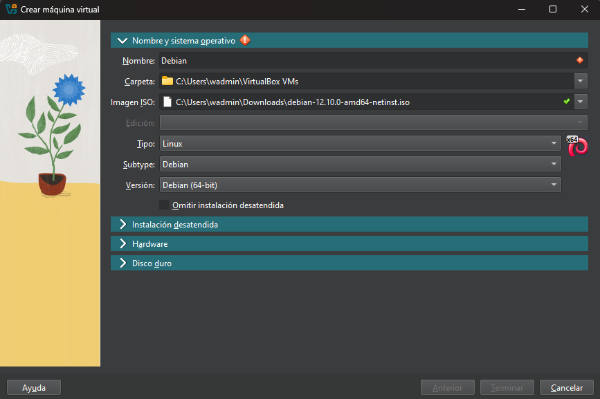

Configuramos el usuario desde VirtualBox

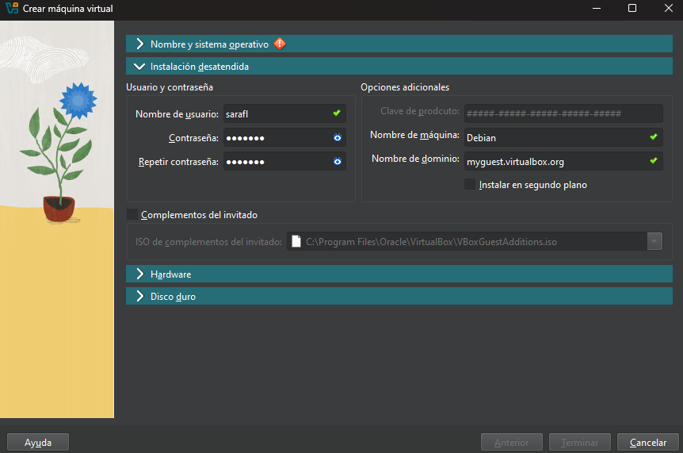

Y abrimos Debian

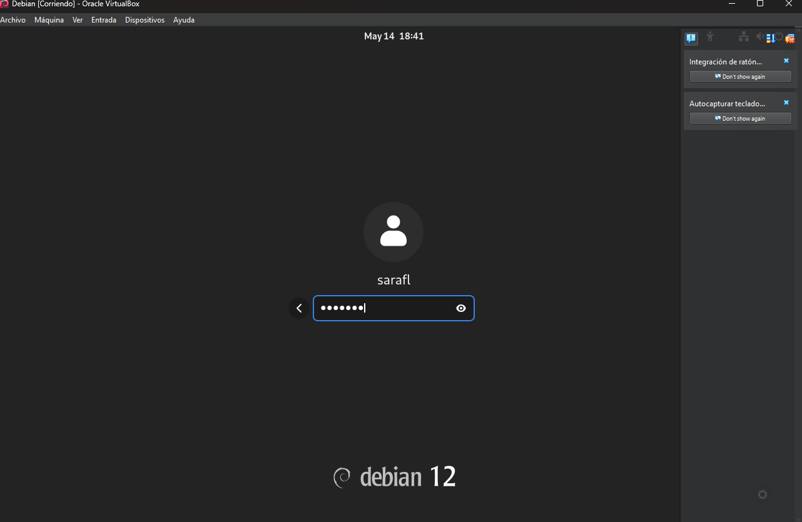

# CONFIGRAMOS KALI

Añadimos Kali a Debian

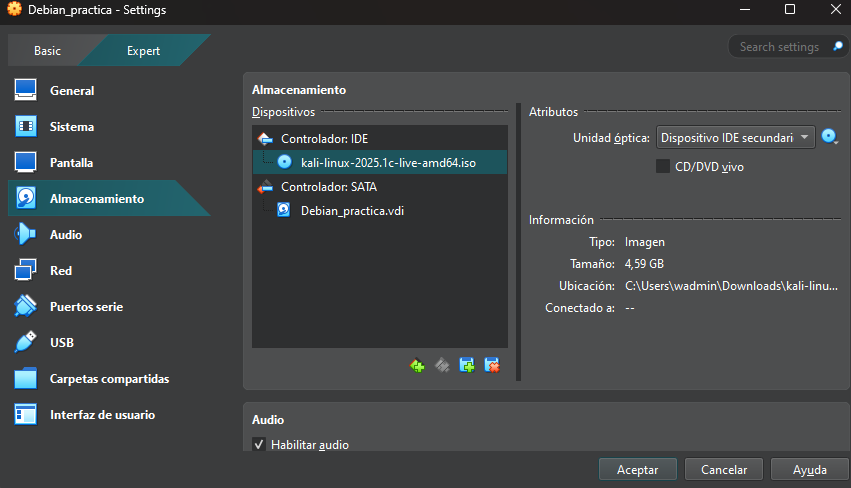

Pulsamos F12 para entrar en el boot menu y seleccionamos la opción de arranque (opción c)

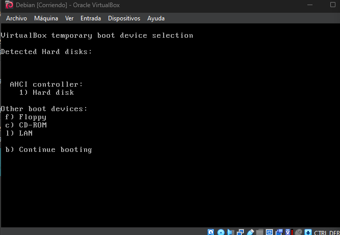

Arrancamos la máquina e iniciamos con el live

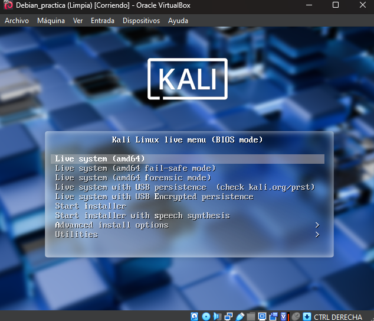

Ponemos la distribución del teclado en castellano

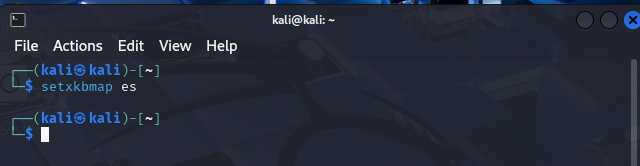

Iniciamos con '''sudo su''' y ejecutamos '''df -Th''' para ver que discos están conectados al equipo.

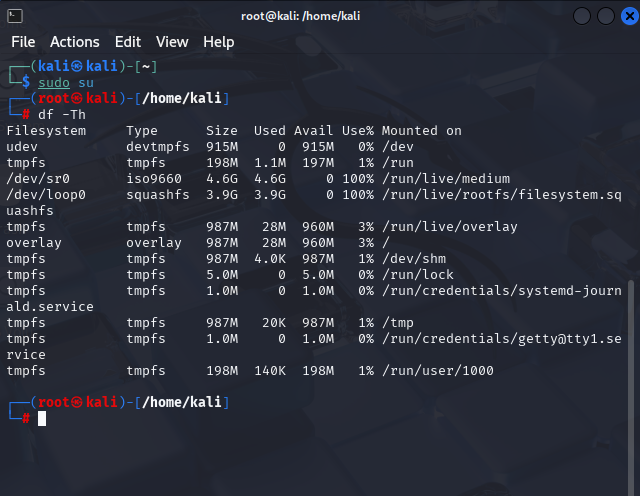

Hacemos '''ls /dev''' para buscar los dispositivos conectados al equipo y buscamos los '''/ds.'''
Estos serán los discos en los que está instalado el Debian y sobre el que está corriendo Kali.

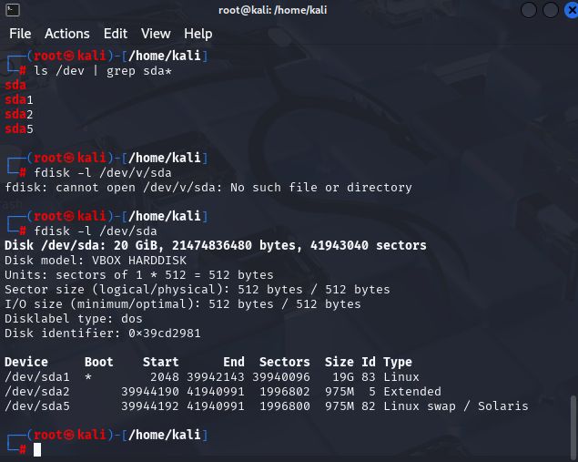

# USO DE CHROOT

Ahora vamos a usar chroot para modificar el directorio raiz de Kali para cargar el sistema de ficheros de Debian '''/dev/sda'''
Vamos a crear un directorio en la ruta, donde montamos la información.
'''mkdir /mnt/recuperar && ld -ld /mnt/recuperar'''

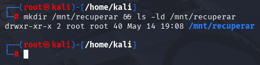

Ahora montamos el disco

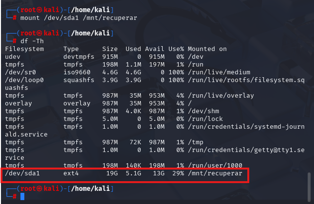

Una vez montado el disco comprobamos que la raíz del Debian esta en '''/mnt/recuperar'''

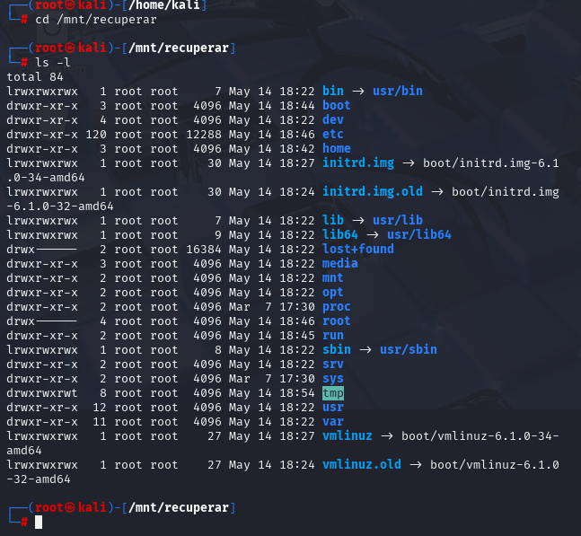

# MONTAMOS DIRECTORIOS

Para usar la raíz del directorio '''/recuperar''' necesitamos montar los directorios:
'''/proc, /sys y /dev''' dentro de la carpeta '''/recuperar'''.

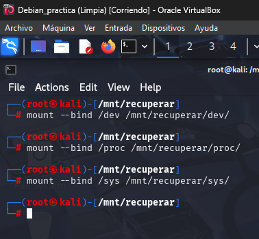

Ahora usamos el comando '''chroot /mnt/recuperar /bin/bash'''

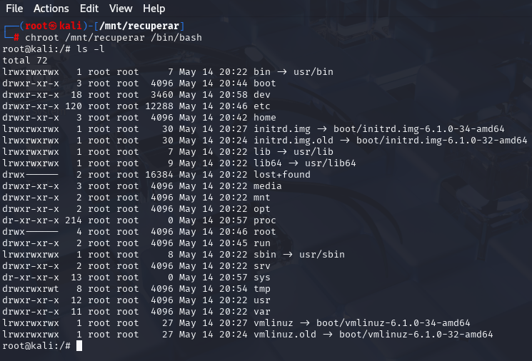

Comprobamos que los ficheros son los de Debian observando el fichero '''/etc/passwd'''

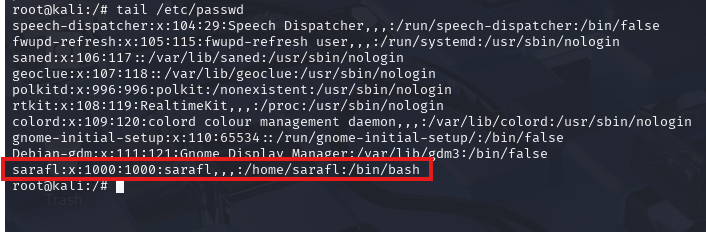

Ahora somos root en Debian, lo que nos permite realizar acciones dentro de Debian.
Vamos a cambiarle la contraseña al usuario de Debian

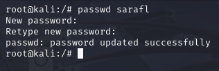

Corroboramos en Debian que se ha cambiado la contraseña.

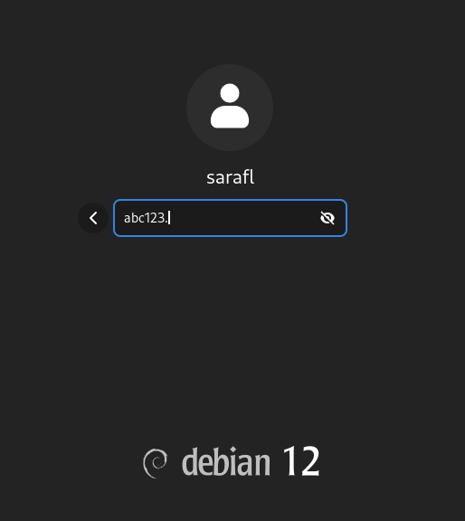
